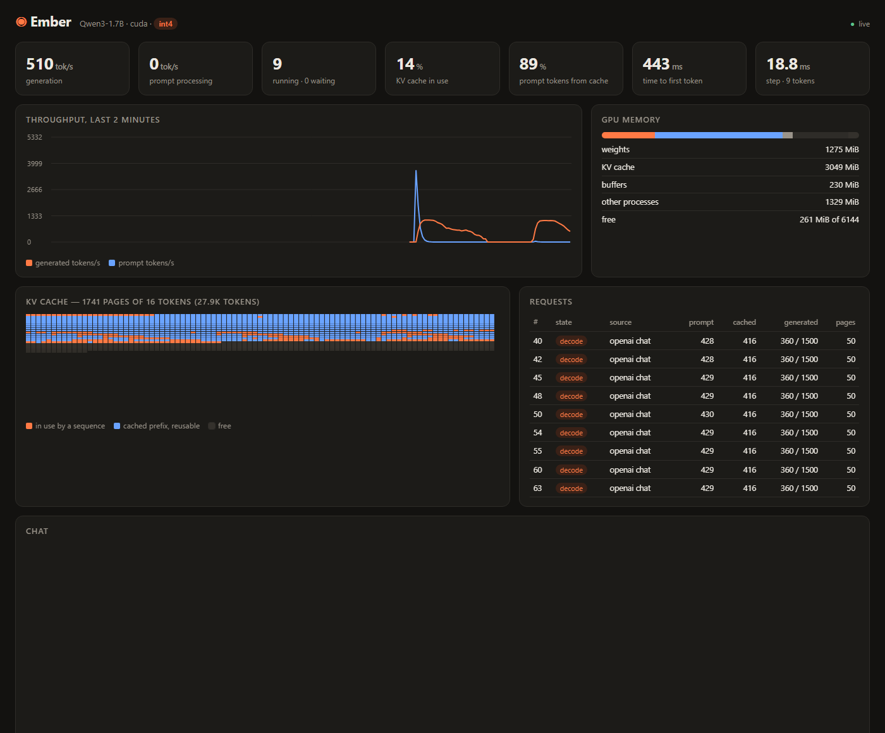

# Ember

An LLM inference engine written from scratch in C++20 and CUDA: it loads a
Hugging Face model (the Qwen3 family), runs it on an NVIDIA GPU as fast as
the hardware allows, and serves many conversations at once through
OpenAI- and Anthropic-compatible APIs, with a live dashboard.

No PyTorch, no llama.cpp, no vLLM, no cuBLAS: the tokenizer, the kernels, the
memory manager, the scheduler and the HTTP server are all in this repository.
PyTorch appears only in the tests, as the reference Ember is checked against.

```
$ ember serve -q int4
[    2.6] info  cuda backend on NVIDIA GeForce RTX 2060: qwen3 with 1.72B parameters | weights 1275 MiB, KV cache 28080 tokens
[    2.6] info  ready: http://127.0.0.1:8080/  (dashboard), API at /v1/chat/completions and /v1/messages
```



## What is in it

- **Kernels written by hand** for Turing GPUs and later: tensor-core GEMM
  (`mma.sync` + `ldmatrix`), a tensor-core GEMV that streams weights at 85-95%
  of the memory bandwidth, FlashAttention-2-style prefill attention, paged
  decode attention, fused QK-norm + RoPE + cache write, fused SiLU and residual
  epilogues, GPU sampling without sorting.
- **Paged KV cache** (blocks of 16 tokens, like virtual memory) with
  **automatic prefix caching**: shared system prompts and earlier turns of a
  conversation are computed once.
- **Continuous batching**: requests join and leave the running batch at every
  step; prompts are read in chunks so generation never stalls; when memory runs
  out, the newest sequence is preempted and resumed later.
- **Quantization** (weight-only int8 and int4) with a measured quality recipe:
  int4 keeps the sensitive matrices in int8, for ~0-5% perplexity at 2.2x the
  f16 decode speed.
- **Speculative decoding** with a draft model, designed so the output is
  *identical* to normal decoding with the same seed.
- **Batch-invariant decoding**: a request produces the same tokens whether it
  runs alone or among 63 others.
- **CUDA Graphs** for decode steps (one launch instead of ~300).
- **An HTTP server** with the OpenAI Chat Completions and Anthropic Messages
  APIs (streaming, stop sequences, Qwen3 reasoning split out), Prometheus
  metrics, and a **live dashboard** showing throughput, the KV cache page by
  page, the requests in flight, and a chat.
- **A byte-level BPE tokenizer** that reproduces Hugging Face's exactly, and the
  Qwen3 chat template.
- **A CPU backend** (f32, AVX2) used as a reference and to run everything
  without a GPU.

## Results

Qwen3-1.7B on an RTX 2060 laptop GPU (6 GB), compared with llama.cpp on the
same machine, same model, comparable formats (llama.cpp b11429, CUDA 13.4,
flash attention on). Generation throughput is tokens per second after the
prompts are read (llama.cpp's `S_TG`), median of 3 runs, engines alternated
with cool-down pauses. Full tables and method: [docs/BENCHMARKS.md](docs/BENCHMARKS.md).

RESULTS_TABLE

Quality of the formats, perplexity on held-out text (lower is better):

| Weights | Weight memory | English (Python tutorial) | Romanian (Wikipedia) |
|---|---:|---:|---:|
| f16 | 3282 MiB | 13.20 | 13.03 |
| int8 | 1752 MiB | 13.09 | 12.94 |
| int4 (Ember's recipe) | 1275 MiB | 13.19 | 13.70 |
| int4, every matrix | 1050 MiB | 19.76 | 22.32 |

The f16 model matches PyTorch to within 0.1% relative error after all 28
layers, and generates the same greedy tokens.

## Quick start

Requirements: an NVIDIA GPU with compute capability 7.5+ (RTX 20xx or newer),
the [CUDA Toolkit](https://developer.nvidia.com/cuda-downloads) 12.x or 13.x,
CMake 3.24+, and a C++20 compiler (Visual Studio 2022+ on Windows, GCC 13+ or
Clang 17+ on Linux). Without CUDA, Ember builds with the CPU backend only.

```bash
# 1. Build
cmake -S . -B build
cmake --build build --config Release

# 2. Download the models (Qwen3-0.6B and Qwen3-1.7B, Apache 2.0, ~4.6 GB)
bash models/download.sh

# 3. Use it                          (on Windows the binary is build/Release/ember.exe)
build/ember generate -p "Explain the KV cache in two sentences."
build/ember chat -q int4
build/ember serve -q int4            # then open http://127.0.0.1:8080/
```

If CMake does not find CUDA with the Visual Studio generator, point it at the
toolkit: `cmake -S . -B build -T cuda="C:/Program Files/NVIDIA GPU Computing Toolkit/CUDA/v13.4"`.

### Commands

| Command | What it does |
|---|---|
| `ember generate -p TEXT` | one answer, streamed, with timing |
| `ember chat` | interactive chat; earlier turns stay in the KV cache (`/reset`, `/think on`) |
| `ember serve` | HTTP server + dashboard (`--host`, `--port`) |
| `ember bench` | prefill, decode and batched throughput |
| `ember perplexity FILE...` | quality of a weight format on text files |
| `ember kernels` | GEMM bandwidth of every kernel on the model's shapes |
| `ember info` | model, memory plan, KV cache capacity |

Common options: `-m DIR` (model), `-q f16|int8|int4`, `--draft DIR` (speculative
decoding), `--temp/--top-p/--top-k/--min-p/--seed/--greedy`, `--think` (Qwen3
reasoning), `--device cpu`. `ember help` lists everything.

### The API

```bash
curl http://127.0.0.1:8080/v1/chat/completions -H "Content-Type: application/json" -d '{
  "messages": [{"role": "user", "content": "What is paged attention?"}],
  "max_tokens": 200, "stream": true}'
```

Any OpenAI or Anthropic client works:

```python
from openai import OpenAI
client = OpenAI(base_url="http://127.0.0.1:8080/v1", api_key="unused")
reply = client.chat.completions.create(model="ember", messages=[{"role": "user", "content": "Hi!"}])

import anthropic
claude_style = anthropic.Anthropic(base_url="http://127.0.0.1:8080", api_key="unused")
msg = claude_style.messages.create(model="ember", max_tokens=200, messages=[{"role": "user", "content": "Hi!"}])
```

Endpoints: `POST /v1/chat/completions`, `POST /v1/completions`,
`POST /v1/messages`, `GET /v1/models`, `GET /health`, `GET /metrics`
(Prometheus), `GET /api/stats` and `GET /api/events` (dashboard data), `GET /`
(dashboard). Qwen3 reasoning is enabled per request with
`"chat_template_kwargs": {"enable_thinking": true}` (OpenAI) or
`"thinking": {"type": "enabled"}` (Anthropic) and comes back separately.

## How it works

The short version - the long one is [docs/ARCHITECTURE.md](docs/ARCHITECTURE.md)
and [docs/KERNELS.md](docs/KERNELS.md):

```
 HTTP clients ──▶ server   (thread per connection, SSE streaming)
                    │ submit / stream tokens
                    ▼
                  engine   (one thread: schedule → forward → sample → stream, every step)
                    │ ragged batch: prompt chunks + decode tokens of many sequences
                    ▼
                  backend  CUDA kernels  |  CPU reference
                    │
                  paged KV cache + prefix cache
```

- **Why decode is about memory.** Generating a token reads every weight once
  and does little arithmetic, so a step costs *weight bytes / bandwidth*:
  3.3 GB / 264 GB/s = 12.4 ms for f16 Qwen3-1.7B, at most ~80 tokens/s for one
  sequence. Ember reaches 85-95% of that bandwidth in its GEMV kernels; going
  further means reading fewer bytes (quantization), or reading them once for
  many sequences (batching), or producing several tokens per read (speculative
  decoding). Ember does all three.
- **Why batching works.** The weights are read once per step whether the batch
  has 1 or 32 sequences; 32 sequences produce 32 tokens for little more than
  the cost of one.
- **Why paging.** Reserving memory for the maximum length of every
  conversation wastes most of it; pages of 16 tokens are allocated as
  sequences grow, freed when they end, and shared between sequences with the
  same prefix.

## Testing

```bash
reference/.venv/Scripts/python reference/golden.py    # once: PyTorch reference data (needs torch + transformers)
build/ember_tests                                      # everything (Windows: build/Release/ember_tests.exe)
build/ember_tests tokenizer -v                         # a subset, verbose
```

- **Tokenizer and chat template** against Hugging Face on hard inputs.
- **Model**: CPU backend vs PyTorch (2e-6 relative error, identical greedy
  text); CUDA backend vs PyTorch layer by layer (1e-3, f16) and vs the CPU
  backend on long prompts read in uneven chunks.
- **Kernels**: every GEMM variant and epilogue on awkward shapes, quantized
  kernels vs dequantized weights, the GPU sampler's distribution.
- **Engine**: a fake model that reads its context back from the paged cache
  (so any block-accounting mistake changes the output), 60 concurrent requests
  in a cache too small for them (forcing preemption), prefix sharing,
  cancellation, speculative decoding identical to plain decoding.
- **Server**: both APIs end to end over real sockets, plain and streaming.
- **API compatibility**: `reference/sdk_check.py` runs the official OpenAI and
  Anthropic Python SDKs against a running server; `reference/load_test.py`
  drives many concurrent streaming clients.

CI (GitHub Actions) builds and tests on Linux, Windows and macOS (CPU), under
AddressSanitizer + UndefinedBehaviorSanitizer, and compiles the CUDA backend for
several GPU generations. GitHub's runners have no GPU, so the CUDA tests run
locally.

## Project layout

```
src/common/       JSON, mmap, fp16, thread pool, logging
src/model/        config, safetensors, Unicode + NFC, BPE tokenizer, chat template
src/backend/      Backend interface, sampling; cpu/ (reference) and cuda/ (kernels)
src/kvcache/      block manager with prefix caching
src/engine/       scheduler, continuous batching, speculative decoding
src/server/       HTTP server, OpenAI/Anthropic APIs, text streaming
web/              the dashboard (compiled into the binary)
tools/            the ember command line
tests/            unit, kernel, model, engine and server tests
reference/        PyTorch reference data, SDK checks, load test, eval texts
bench/            comparison with llama.cpp
docs/             architecture, kernels, benchmarks
```

## Limitations

- NVIDIA GPUs only (compute capability 7.5+); one GPU.
- Models: the dense Qwen3 family in safetensors (tested with Qwen3-0.6B and
  Qwen3-1.7B; the 4B and 8B use the same architecture but need more than 6 GB
  in f16). No mixture-of-experts, no RoPE scaling, no vision.
- Batch invariance holds up to 64 decode tokens per step.
- The API covers text chat; no tool calling, no logprobs.

## Pushing to GitHub

1. Create an **empty** repository named `Ember` on GitHub (no README, license or
   .gitignore - they are here already).
2. From this folder:

   ```bash
   git remote add origin https://github.com/YUStulinu/Ember.git
   git branch -M main
   git push -u origin main
   ```

3. Later changes:

   ```bash
   git add -A
   git commit -m "Describe the change"
   git push
   ```

The model weights, build output, evaluation texts and llama.cpp binaries are in
`.gitignore`; `models/download.sh` and `reference/` recreate them. GitHub
Actions runs the CI described above on every push.

## License

MIT - see [LICENSE](LICENSE). The Qwen3 models are Apache 2.0 and are not
included; `models/download.sh` fetches them from Hugging Face.
